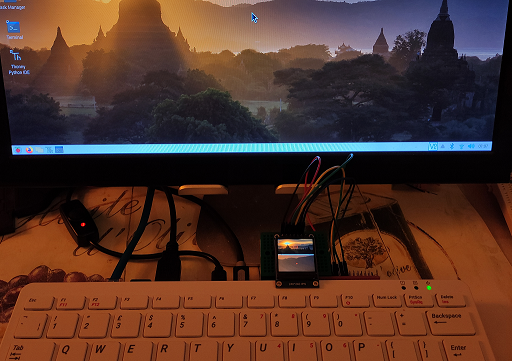
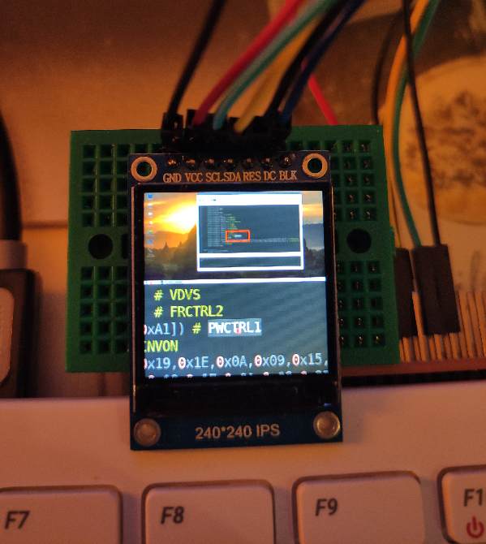

# micro-displays
Micro Displays for Raspberry Pi 
## Why?
_**I'm super bored in lockdown.**_ Add a Raspberry Pi 400 and a few tiny displays I bought for a couple of quid...

The top half of the micro display shows the full screen and the bottom half is a zoom centered around the mouse cursor.



Example of code editing using this set up :-)



## IPS 240x240

### Dependencies

Requires a couple of python libs:

```bash
$ pip3 install pyscreenshot
$ sudo apt install python3-xlib
```

### Raspberry Pi HDMI out

You must force the Raspberry Pi to output HDMI even if a monitor is not connected.

In /boot/config.txt make sure the following lines are uncommented:

```bash
max_framebuffers=2
hdmi_force_hotplug:0=1
hdmi_group:0=1
hdmi_mode:0=16 
```
See also https://www.raspberrypi.org/forums/viewtopic.php?f=28&t=243886#p1488488

### Start up on reboot

To enable at session startup on reboot:

```bash
pi@raspberrypi:~ $ cp /etc/xdg/lxsession/LXDE-pi/autostart /home/pi/.config/lxsession/LXDE-pi/
```

and add the following lines

```bash
pi@raspberrypi:~ $ cat /home/pi/.config/lxsession/LXDE-pi/autostart 
@lxpanel --profile LXDE-pi
@pcmanfm --desktop --profile LXDE-pi
@xscreensaver -no-splash
@python3 /home/pi/micro-displays/main240x240.py 2>&1 >> /home/pi/micro-displays/stdout.log & 
```
